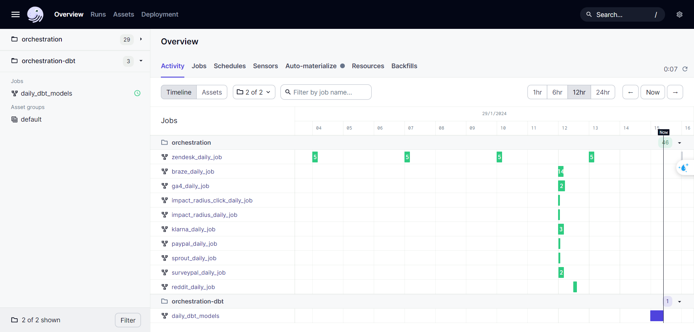
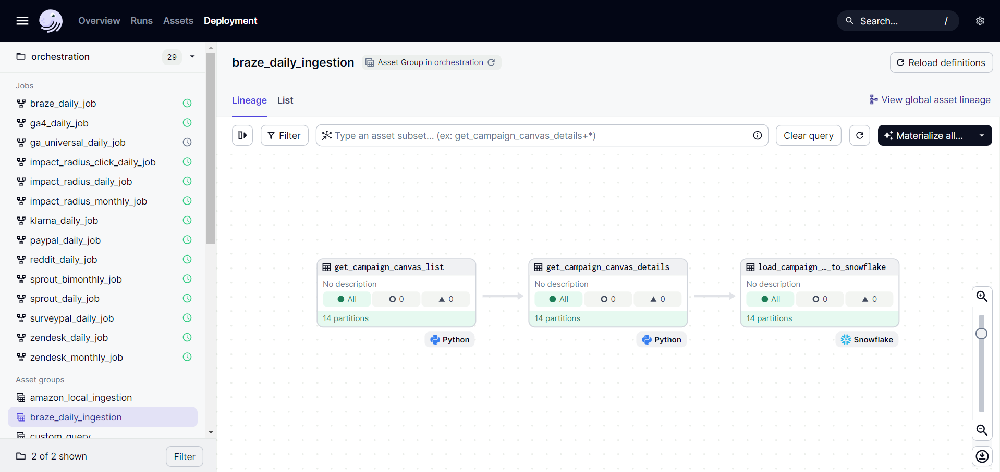
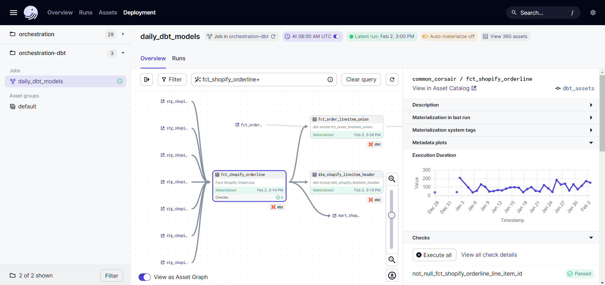

# __Overview__

## __Architecture of Dagster__
Dagster's architecture comprises several key components, each playing a vital role in the framework:

### __Dagit - Dagster's Web Interface__

Dagit is Dagster's visual interface, accessible through a web browser. It serves as a monitoring and management hub for data pipelines and handles GraphQL queries. 

Key features include:

- ***Jobs***: Explore and launch job runs.
- ***Runs***: Lists all runs, which you can further filter by job name, run ID, execution status, or tag.
- ***Assets***: Lists all assets, which you can filter further by asset key.
- ***Schedules***: Lists all schedules and the detail information such as the pipeline name, the schedule's frequency (e.g. hourly, daily), the next scheduled run, and the status of the schedule.
- ***Sensors***: Lists all sensors.
- ***Deployment overview***: Displays information about code locations, definitions, daemons and configuration details.

### __Dagster daemon__ 

A background service handling tasks like scheduling and monitoring pipeline runs.

- ***Scheduler daemon***: Creates runs from active schedules (a schedule executes a job at a fixed interval).
- ***Run queue daemon***: Launches queued runs and backfill jobs, taking into account any limits and prioritization rules set on the instance.

### __Code location server__

Manages the project's codebase, updating it as changes are detected. It uses RPC for communication with other Dagster components, ensuring access to pipeline-defining code.

### __Job execution processes__

- ***Dagster Storage***

    Dagster Storage is responsible for persisting metadata about pipeline runs, including run history, run status, and other relevant information. It provides a storage backend for storing and retrieving this metadata.

    We are using a PostgreSQL database to store metadata about pipeline runs, event logs, schedule/sensor ticks and more.

- ***Run Coordinator***

    The Run Coordinator is responsible for coordinating the execution of pipeline runs. It manages the scheduling and execution of runs based on the defined schedules and dependencies. The Run Coordinator ensures that runs are executed in the correct order and handles any dependencies between runs.

- ***Run Launcher***

    The Run Launcher is responsible for launching pipeline runs. It takes care of starting the execution of runs on the appropriate execution environment, such as a local machine, a remote server, or a cloud-based infrastructure. The Run Launcher handles the deployment and execution of the pipeline code and manages the resources required for the execution.

These components work together to ensure the smooth execution and management of pipeline runs in the Code Location Server.

## __Dagster's project structure__

Dagster is employed for two primary purposes:

-   ***Data Ingestion***: This involves constructing pipelines to ingest data from various API sources into Snowflake.
-   ***DBT Migration and Scheduling***: Integrating and managing dbt jobs within Dagster.

To define jobs and schedules for these tasks, we use two distinct code locations: **orchestration** and **orchestration-dbt**. Which is also reflected in the Dagster UI:

=== "Dagster UI"

    !!! info ""
        

=== "Sample ingestion asset"

    !!! info ""
        

=== "Sample dbt asset"

    !!! info ""
        

The following is a comprehensive breakdown of each folder and file in my Dagster project setup:

``` yaml title="Dagster project structure"
dagster_project/
├── compute_logs           # (1)!
├── dbt_project            # (2)!
├── local_artifact_storage # (3)!
├── orchestration/         # (4)!
│   ├── assets/            
│   ├── jobs/              
│   ├── resources/         
│   ├── schedule/          
│   ├── utils/             
├── orchestration-dbt      # (5)!
├── postgres_data          # (6)!
├── .env                   # (7)!
├── dagster.yaml           # (8)!
├── Dockerfile             # (9)!
├── docker-compose.yaml    # (10)!
├── requirements.txt       # (11)!
├── workspace.yaml         # (12)!

```

1. For logs generated during the execution of the pipelines: computations performed, errors encountered, performance metrics, etc.
2. For dbt project resources: macros, models, tests, snapshots, authentication details, etc.
3. For local copies of important artifacts and pipeline outputs.
4. For orchestrating ingestion pipeline tasks and processes within Dagster:
    - `assets/`: For storing [assets](https://docs.dagster.io/concepts/assets/software-defined-assets) (description, in code, of an asset that should exist and how to produce and update that asset). 
    - `jobs/`: For storing [jobs](https://docs.dagster.io/concepts/ops-jobs-graphs/jobs#jobs) (main unit of execution and monitoring for portion of a graph of assets).
    - `resources/`: For storing [resources](https://docs.dagster.io/concepts/resources) (description for ways to connect to external services like databases, APIs, or custom tools).
    - `schedule/`: For storing [schedules](https://docs.dagster.io/concepts/partitions-schedules-sensors/schedules#schedules) (definition that is used to execute a job at a fixed interval).
    - `utils/`: For storing utility functions.
5. For orchestrating dbt jobs within Dagster.
6. For storing pipeline metadata and logs.
7. For sensitive environment variables: database URLs, API keys, passwords, etc.
8. For configuring Dagster: settings for Dagster instances, executors, and other operational parameters of the data pipelines, etc.
9. For creating Docker image for the project by packaging the application and its dependencies into a container for consistent deployments.
10. For defining postgres and dagster containers from images as well as the network for communication between containers.
11. For listing all the Python dependencies required for the project which will be included in the Dockerfile.
12. For configuring code location server.