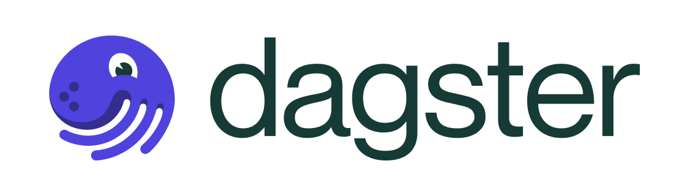

!!! info ""
    

Dagster is an innovative open-source framework designed for orchestrating and managing data workflows, especially in the fields of machine learning, analytics, and ETL processes. It excels in enhancing the productivity and reliability of both development and deployment stages of data pipelines. Dagster's approach allows defining pipelines through data flow between reusable components, efficiently handling tasks like scheduling, dependency management, and execution.