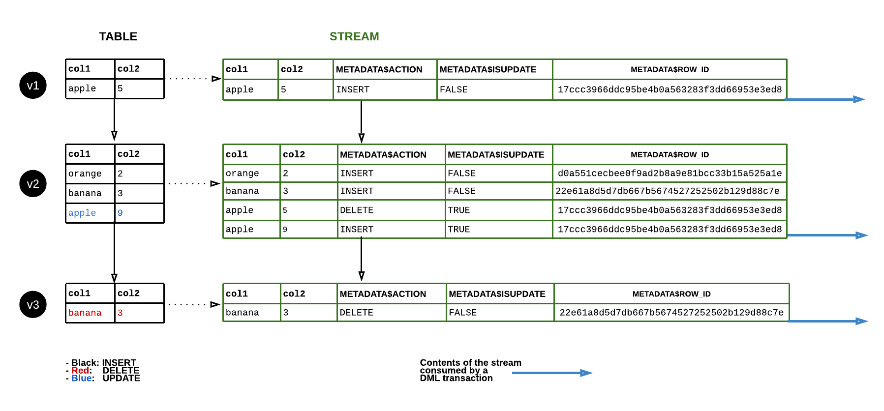
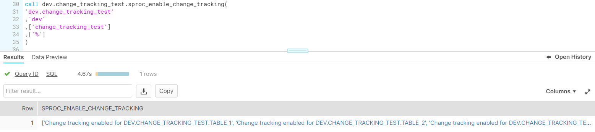
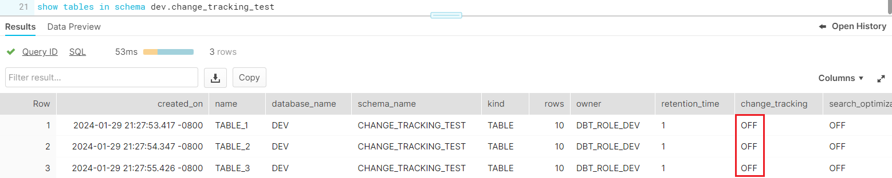
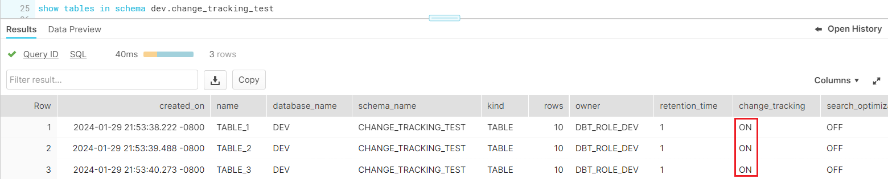
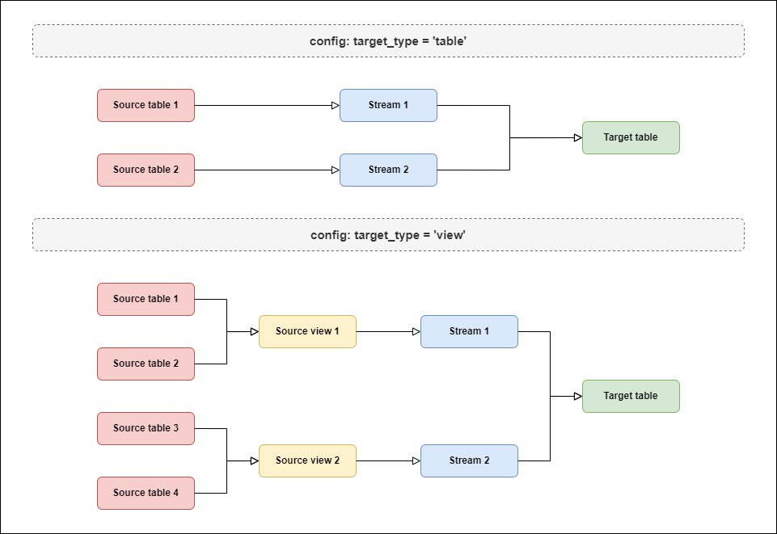
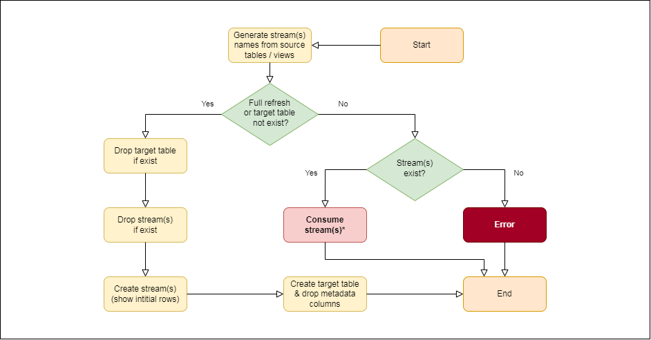
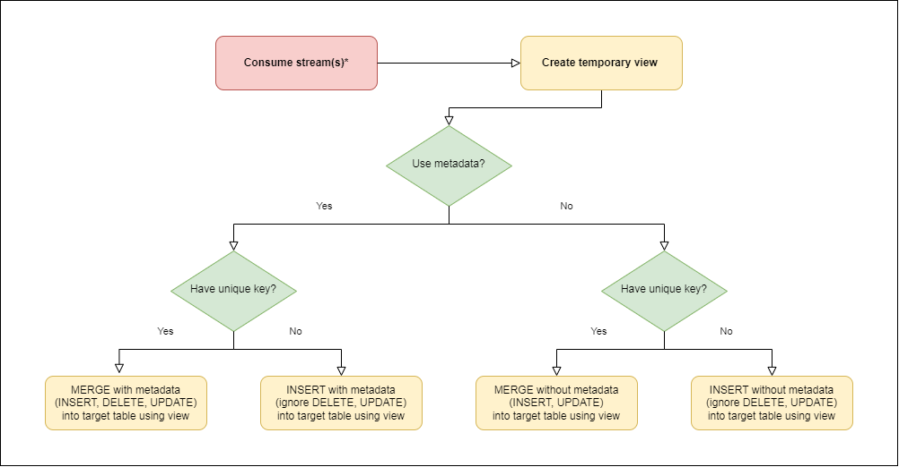

# __Snowflake Stream__

## __Introduction__

Snowflake stream is a powerful feature that enables users to track changes (inserts, updates, and deletes) to tables within the Snowflake environment. A stream is essentially a metadata object that records changes made to a specified table since the last time the stream was queried or consumed. This capability is vital in scenarios such as incremental data loads, real-time analytics, and Change Data Capture (CDC) processes.

Snowflake streams work based on these principals:

-   ***Change tracking***: Snowflake Streams maintain a log of changes made to the source object since the last time changes were consumed. This log is presented as a virtual table that contains all the new, modified, or deleted rows.
-   ***Virtual table***: The stream is not a physical table; rather, it's a virtual representation of change data. It doesn't store the actual data but metadata about the changes.
-   ***Zero-copy cloning***: The underlying data is not duplicated. Snowflake's architecture ensures that the stream operates on metadata, maintaining the platform's efficiency.
-   ***Offset tracking***: Snowflake uses 3 system-generated column 
    -   ***METADATA$ROW_ID***: to track changes to specific rows over time as the id is unique and immutable
    -   ***METADATA$ACTION***: to track the type of change (INSERT, DELETE, UPDATE) 
    -   ***METADATA$ISUPDATE***: to distinguish between inserts and updates.

!!! info ""
    

## __Importance__

-   ***Efficient data processing without time column***: Snowflake streams excel in environments without a reliable time column, tracking all changes regardless of timing. This is ideal for data with frequent updates or deletions, ensuring accurate and efficient processing.
-   ***Real-time data analysis***: Snowflake streams provide real-time monitoring of data changes, enabling swift analysis and decision-making, crucial in environments with constant data modifications.
-   ***Streamlined ETL and cost savings***: By eliminating complex change detection scripts, Snowflake streams simplify ETL processes, especially where data frequently changes, reducing computational needs and costs.

## __Strategy__

Currently, our team exclusively utilizes streams for the Mparticle source, covering more than 350 source tables. This approach is driven by two key reasons:

-   ***Unreliable batch timestamp***: The batch timestamp within Mparticle reflects the data's arrival time in Mparticle, not in Snowflake. Consequently, this can result in instances where older Mparticle data is delivered to Snowflake later than expected.
-   ***Frequent data deletion***: To adhere to GDPR regulations, Mparticle regularly deletes certain user data. This deletion is also reflected in our Snowflake tables via an API. The incremental strategy provided by dbt is unable to accommodate this type of data deletion, necessitating an alternative approach.

Moreover, implementing streams within dbt presents a higher complexity and typically less efficient than the conventional time-based incremental strategy. This is primarily because streams involve a comparison between two states of the source table which will result in longer query times. Therefore, we resort to using streams only when there are no other viable alternatives.

To implement streams in dbt, we would need to do the following:

-   ***Source table preparation***: To create a stream on a Snowflake object, you need to have a role with certain permissions and the object you are working need to have change tracking enabled
-   ***Creating streams***: You can then create streams on your source object (tables, views or external tables). In our case, because we have hundreds of source tables, we decided to create streams on a few views for easier monitoring instead. Please note that the maximum number of base tables allowed for a stream is 100 so make sure that your view is querying less than this number.
-   ***Consuming streams***: Consuming a stream in Snowflake involves applying changes to another table or incorporating them into a data pipeline, typically via a SQL query that selects from the stream and executes an operation, like inserting data into another table. Once these changes are consumed and the transaction is committed, Snowflake automatically clears these changes from the stream (called flushing), ensuring only new changes appear in subsequent queries. While Snowflake tasks are more common for this, I've developed a specialized dbt package for more efficient monitoring and processing.

## __Code implementation__

### __Preparing source tables__

To create a stream from a source table in Snowflake, it's essential to enable change tracking, typically done with the SQL command: 

```sql title="enable change tracking statement" linenums="1"
alter table << table name >> set change_tracking = true;
```

However, this approach becomes impractical for a large number of tables, such as in scenarios involving over 350 tables. To streamline this process, I've developed a stored procedure (macro) in Snowflake. This procedure efficiently automates enabling change tracking for specific tables. 

It's particularly useful for handling numerous tables or when tables need to be selected based on certain schema and name patterns. The stored procedure manages the entire workflow, including identifying target tables, applying change tracking settings, and performing necessary clean-up operations. Upon completion, it returns an array detailing the change tracking activation status for each table, thereby offering a scalable and automated solution for enabling change tracking in Snowflake.

```sql title="dbt_project/macros/sproc_enable_change_tracking.sql" linenums="1"


create or replace procedure {{ target.schema }}.sproc_enable_change_tracking(
    holder_destination string
    ,database_name string
    ,schema_pattern array
    ,table_pattern array
)
returns string
language python
runtime_version = '3.8'
packages = ('snowflake-snowpark-python')
handler = 'sproc_enable_change_tracking_py'
as
$$
def sproc_enable_change_tracking_py(snowpark_session, holder_destination: str, database_name: str, schema_pattern: list, table_pattern: list):

    ## Define change_tracking function
    def enable_tracking(session, table_name):
      try:
          query = f"alter table {table_name} set change_tracking = true"
          session.sql(query).collect()
          return f"Change tracking enabled for {table_name}"
      except Exception as e:
          return f"Error enabling change tracking for {table_name}: {str(e)}"
        
    ## Execution
    session = snowpark_session
    
    # Format each item in the list as a quoted string
    quoted_schema_pattern = [f"'{schema}'" for schema in schema_pattern]
    quoted_table_pattern = [f"'{table}'" for table in table_pattern]

    # Join the quoted strings with commas and enclose in parentheses
    schema_string = f"({', '.join(quoted_schema_pattern)})"
    table_string = f"({', '.join(quoted_table_pattern)})"
    
    # Create the holder for the table list
    session.sql(f"create or replace table {holder_destination}.change_tracking_status (table_name varchar)").collect()

    session.sql(f"alter table {holder_destination}.change_tracking_status set change_tracking = true").collect()
    
    # Get the table list
    session.sql(f"show tables in database {database_name}").collect()

    session.sql(
        f"""
        insert into {holder_destination}.change_tracking_status(table_name)
        select concat_ws('.', "database_name", "schema_name", "name") as table_name
        from table(result_scan(last_query_id())) 
        where "change_tracking" = 'OFF'
        and "kind" = 'TABLE'
        and "database_name" ilike '{database_name}'
        and "schema_name" ilike any {schema_string}
        and "name" ilike any {table_string}
        """
    ).collect()
    
    table_list = session.sql(f"select * from {holder_destination}.change_tracking_status").collect()
    
    # Run change_tracking for each table
    results = []
    for table in table_list:
        result = enable_tracking(session = session, table_name = table[0])
        results.append(result)
        
    # Drop holder
    session.sql(f"drop table {holder_destination}.change_tracking_status").collect()
        
    return results
  
$$


```

=== "Calling procedure"

    !!! info ""
        

=== "Before procedure"

    !!! info ""
        

=== "After procedure"

    !!! info ""
        

### __Creating incremental stream package__  

To develop a custom materialization in dbt, you can employ the materialization block, which functions much like a macro block. Once defined, this custom materialization can be applied directly within your dbt models. Given the complexity of creating custom materializations, for detailed guidance, you may consult [this documentation: Creating New Materializations](https://docs.getdbt.com/guides/create-new-materializations?step=1).

While creating an incremental stream materialization, I drew inspiration from the incr_stream package for dbt, available at [dbt Hub - incr_stream](https://hub.getdbt.com/arnoN7/incr_stream/latest/), while making specific modifications to meet our team's unique needs. 

This package comprises two primary elements:

-   A file containing various helper macros.
-   A file containing the custom materialization's definition.

=== "Helper macros"

    ```sql title="dbt_project/macros/materializations/incremental_stream/stream_macros.sql" linenums="1"
    {#-- Return stream name or source name in full-refresh mode --#}
    
        {{stream_input(table_name, 'source', source_name=source_name)}}
    

    {#-- Return stream name or ref name in full-refresh mode --#}
    
        {{stream_input(model_name, 'ref')}}
    

    
        
            
        
    

    
        
        {{- config.set('src_table', table_name) -}}
        
        
            
        
        
            {{- config.set('src', source_name) -}}
            {{- unique_append(list_tables, ('source', source_name, table_name))  -}}
            
        
            
            {{- unique_append(list_tables, ('ref', table_name))  -}}
        
        {{- config.set('src_list', list_tables) -}}
        
        
        
        
        {{input_model | replace(input_database, this.database) | replace(input_schema, this.schema) | replace(table_name, get_stream_name(this.table, table_name))}}
    

    
    {{- 'stream_'~source_table_name~'_'~table_name -}}
    

    
    
    
        
    
    
    
    
    {# No metadata stream for full refresh #}
    
    ,{{ final_alias }}metadata$action, {{ final_alias }}metadata$isupdate, {{ final_alias }}metadata$row_id
    
    

    
        
            {{ return(False) }}
        
            
            {{ return(relation is not none
                    and relation.type == 'table'
                    and model.config.materialized == 'incremental_stream'
                    and not should_full_refresh()) }}
        
    
    ```

=== "Materialization definition"

    ```sql title="dbt_project/macros/materializations/incremental_stream/incremental_stream.sql" linenums="1"
    

    {#-- Get sources and streams names --#}
    
    
    
        {#-- Get the source & target stream name --#}
         
             
         
             
        
        
        {#-- Append the tuple of source_name and stream_name --#}
        
    

    {#-- Get run mode --#}
    
    

    {#-- Start run --#}
    

        {{ log("  => Initializing... " , info=True) }}
        
        drop table if exists {{ target_relation }};

        

            drop stream if exists {{ stream_name }};

            create stream {{ stream_name }} on {{ source_type }} {{ source_name }} show_initial_rows = true;

        

        create table {{ target_relation }} as(
            {{ sql }}
        );

        alter table {{ target_relation }}
        drop column if exists metadata$action, if exists metadata$isupdate, if exists metadata$row_id;

    

        {{ log("  => Consuming stream(s)... " , info=True) }}

        {#-- Execute call ensures that all streams exist before consuming streams --#}
        
            
                describe stream {{ stream_name }};
            
        

        {#-- Execute call ensures that the tmp_relation is created before the columns variable is set --#}
        
            create or replace view {{ tmp_relation }} as(
                {{ sql }}
            );
        

        

        

            

                merge into  {{ target_relation }} target
                using {{ tmp_relation }} source
                on (
                target.{{ key }} = source.{{ key }} and 
                )
                -- Mode DELETE
                when matched and source.metadata$action = 'DELETE' and source.metadata$isupdate = 'FALSE' then delete
                -- Mode UPDATE
                when matched and source.metadata$action = 'INSERT' and source.metadata$isupdate then update set
                
                target.{{ col.name }} = source.{{ col.name }},
                -- Mode INSERT
                when not matched and source.metadata$action = 'INSERT' then insert
                ( 
                {{ col.name }},
                )
                values
                (
                source.{{ col.name }},
                );

            

                insert into {{ target_relation }}  
                select 
                source.{{ col.name }}, 
                from {{ tmp_relation }} source where source.metadata$action = 'INSERT' 
                and source.metadata$isupdate = 'FALSE';

            

        

            

                merge into  {{ target_relation }} target
                using {{ tmp_relation }} source
                on (
                target.{{ key }} = source.{{ key }} and 
                )
                -- Mode UPDATE
                when matched then update set 
                
                target.{{ col.name }} = source.{{ col.name }},
                -- Mode INSERT
                when not matched then insert
                (
                {{ col.name }},
                )
                values
                (
                source.{{ col.name }},
                );

            

                insert into {{ target_relation }}  
                select 
                source.{{ col.name }}, 
                from {{ tmp_relation }} source;
                
            

        

    

    


    

        {#-- Get relation --#}
        
        

        {#-- Get config values --#}
        
        
        

        {#-- setup --#}
        {{ run_hooks(pre_hooks, inside_transaction=False) }}

        {#-- `BEGIN` happens here: --#}
        {{ run_hooks(pre_hooks, inside_transaction=True) }}

        {#-- Run Process --#}
        

        
            {{ build_sql }}
        

        {#-- `COMMIT` happens here --#}
        {{ adapter.commit() }}
        {{ run_hooks(post_hooks, inside_transaction=False) }}
        

        {{ return({'relations': [target_relation]}) }}

    
    
    ```
### __Defining models__

For the config options, it is essential to set four options:

-   ***`materialized` (string)***: Only option is "incremental_stream".
-   ***`source_type` (string)***: The type of the source(s) being referred by the model (all source(s) should have the same type). If not defined, default to "table". Refer to the "Source types" tab for illustration.
-   ***`use_metadata` (boolean)***: Whether or not to use the metadata columns for consuming streams. If not defined, default to "True". Refer to the "Consume stream(s)" tab for illustration.
    -   ***`True`***: For cases where the sql output target models that include metadata columns (event tables like fct).
    -   ***`False`***: For cases where the sql output target models that exclude metadata columns (aggregation tables like dim).
-   ***`unique_key` (list)***: Key used for the MERGE. If not defined, default to using INSERT. Refer to the "Consume stream(s)" tab for illustration.

The model execution process follows these steps:

=== "Source types"

    !!! info ""
        

=== "General process"

    !!! info ""
        

=== "Consume stream(s)*"

    !!! info ""
        

To invoke an incremental stream in the model, you need to use these 2 macros:

-   ***`stream_source`***: To add a stream on a source (replace `source`)
-   ***`stream_ref`***: To add a stream on a dbt model (replace `ref`)

Below are some examples of a dbt model with incremental stream materialization:

=== "stream_source with single table"

    ```sql title="model.sql" linenums="1" hl_lines="3 4 5 6 13"
    {{
        config(
            materialized = 'incremental_stream'
            ,unique_key = ['event_date', 'row_id']
            ,source_type = 'table'
            ,use_metadata = True
            ,snowflake_warehouse=get_warehouse('transforming_warehouse')
        )
    }}

    with source as (

        select * from {{ stream_source('source_name', 'table_name') }}

    ), final as(

        select 

            metadata$row_id as row_id
            ,sysdate()      as stream_timestamp
            ,*
        
        from source
    )

    select * from final
    ```

=== "stream_ref with multiple views"

    ```sql title="model.sql" linenums="1" hl_lines="3 4 5 6 13 17"
    {{
        config(
            materialized = 'incremental_stream'
            ,unique_key = ['event_date', 'row_id']
            ,source_type = 'view'
            ,use_metadata = True
            ,snowflake_warehouse=get_warehouse('transforming_warehouse')
        )
    }}

    with source as (

        select * from {{ stream_ref('source_view_name_1') }}

        union all

        select * from {{ stream_ref('source_view_name_2') }}

    ), final as(

        select 

            metadata$row_id as row_id
            ,sysdate()      as stream_timestamp
            ,*
        
        from source
    )

    select * from final
    ```

!!!note

    It is important to note that if the base table or view is recreated, any associated streams will become invalid, leading to an error: 
    
    !!!failure "error"
        Base table << table name / view name >> dropped, cannot read from stream << stream name >>.

    Therefore, it's advisable to create a stream from a stable source (using `stream_source`) rather than from a dbt model (using `stream_ref`). Consider these cases when employing `stream_ref`:

    -   ***Your source is a table***: Ensure your upstream dbt table is set to "incremental" or "incremental_stream", so it doesn't get recreated with each run, except when a "--full-refresh" flag is used.
    -   ***Your source is a view***: Run your upstream view once, label it as "static" (or with another appropriate tag), and then omit it from daily runs using the "--exclude" flag.

    Employing a `stream_source` over a `stream_ref` is considered a best practice because sources are defined once, listed in the `source.yml` file of dbt, and protected from accidental recreation within dbt runs.