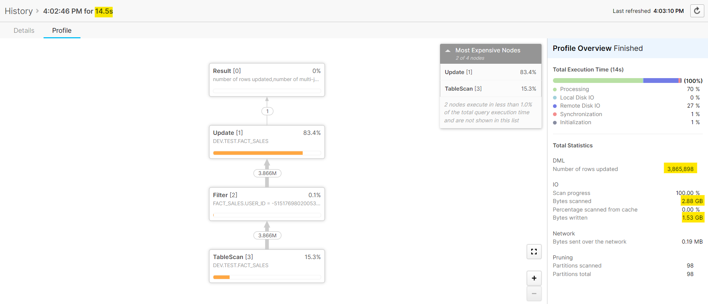
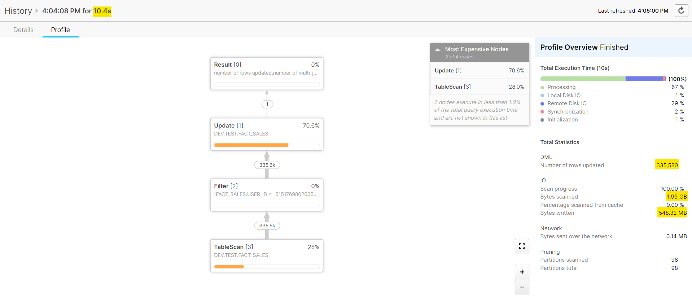

# __Update & Delete Principal__

## __Introduction__

Snowflake stores data in micro-partitions, which are immutable. This is why Snowflake is sometimes described as "insert-only" – because updates and deletes are internally handled by creating new micro-partitions, akin to insertions.

-   ***UPDATE***: Instead of modifying data in-place, Snowflake uses a copy-on-write mechanism where updated records are written to new micro-partitions, and the old ones are logically marked as outdated. This mechanism maintains the immutability of data and is crucial for features like Time Travel and Zero-Copy Cloning.
-   ***DELETE***: Instead of immediately removing data physically, the records are logically marked for deletion, and the data is physically removed later during maintenance processes. This approach, again, supports features like Time Travel.

## __Strategy__

Given Snowflake's architectural design, regularly needing to perform updates and deletes could suggest that your data architecture and loading strategy within Snowflake might require reconsideration. In situations where updates and deletes are unavoidable, consider these approaches:

-   ***Strategic load operation planning***: Plan your data load operations to minimize the need for subsequent updates and deletes. This may involve more thoughtful initial data structuring or preprocessing before loading.
-   ***Optimization of update and delete processes***:
    -   ***Strategic transaction management***: Consolidate related update and delete actions into unified transactions to maintain data consistency and improve performance.
    -   ***Effective clustering***: Implement clustering strategies to streamline the identification of relevant micro-partitions, thereby enhancing efficiency.
    -   ***Effective filtering***: Implement precise filtering criteria to limit the impact on micro-partitions, reducing the scope of updates.
    
In this particular post, we will focus on the optimization of update and delete processes.

## __Code implementation__

<!-- #### a. Strategic transaction management

#### b. Effective clustering

#### c. Effective filtering -->

When an UPDATE statement is executed, Snowflake creates new micro-partitions for the updated data. Therefore effective filtering can help in 2 ways:

-   ***Limit partition creation***: By accurately targeting only the rows that require updating, the creation and modification of micro-partitions are limited.
-   ***Limit data processing***: Specifying the exact rows to update decreases the volume of data processing involved.

Consider a scenario where you have a table named fact_sales that contains over 300 million records. Your task is to update the status column to 'Processed' for all sales records corresponding to a specific user_id. Within this user's data, there are already upwards of 3 million records designated as 'Processed' and over 300,000 records identified as 'Pending'. Let’s compare the performance of 2 different update statements:

=== "Standard update statement"

    ```sql title="statement.sql" linenums="1"="11"
    update dev.test.fact_sales
    set status = 'Processed'
    where user_id = '-5151769802005346433'
    ```

    !!! info ""
        

=== "Optimized update statement"

    ```sql title="statement.sql" linenums="1" hl_lines="4"
    update dev.test.fact_sales
    set status = 'Processed'
    where user_id = '-5151769802005346433'
    and status != 'Processed'
    ```

    !!! info ""
        

| Metrics       | Standard update statement | Optimized update statement | Comment                                                                                                             |
| ------------- | ------------------------- | -------------------------- | ------------------------------------------------------------------------------------------------------------------- |
| Run time      | 14.5s                     | 10.4s                      | The optimized statement shows a notable decrease in execution time.                                                 |
| Rows updated  | 3,865,898                 | 335,580                    | The optimized statement updates significantly fewer rows as it excludes rows already marked as "Processed".         |
| Bytes scanned | 2.88 GB                   | 1.95 GB                    | The optimized statement scans less data, which is a direct result of the additional filter.                         |
| Bytes written | 1.53 GB                   | 548.32 MB                  | The optimized statement writes significantly less data which is in line with fewer rows being updated.              |